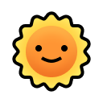
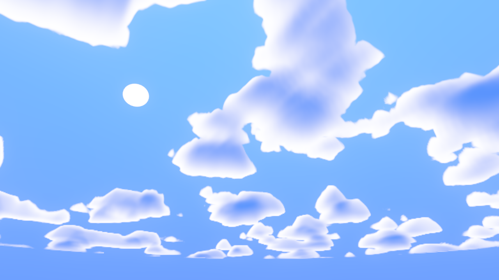
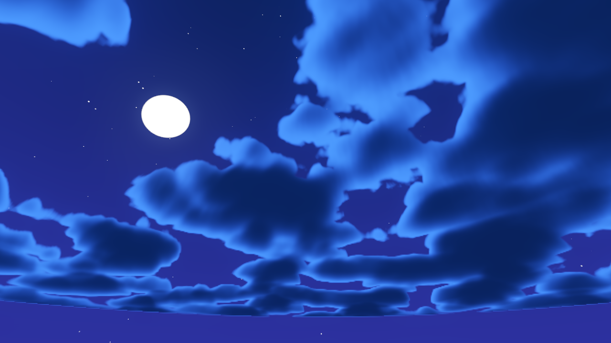

<h1 align="center">

 
Stylized Sky</h1>

An open-source shader for creating stylized skies. Compatible with Godot game engine version 4.

## Preview

<table>
  <tr align="center">
	<td></td>
	<td></td>
  </tr>
  <tr align="center">
	<td>Day sky</td>
	<td>Night sky</td>
  </tr>
</table>

## Features

| Feature  | Description |
| ------------- | ------------- |
| Sky Gradient  | Define the sky color from 3 inputs.  |
| Starfield  | Add twinkling starfield in the background, ideal for nocturnal scenes.  |
| Clouds  | Displays scrolling animated volumetric clouds.  |
| Astro  | Position an image based on the primary Directional Light 3D direction.  |
| Shooting stars | Add shooting stars falling from the top of the skybox. |

## Optimization

The sky shader can be optimized by applying the following changes.

- **Static sky** Enhance performance by making the sky static by removing the `TIME` variable.
- **Sample Reduction** Adjust cloud sampling to fine-tune the balance between quality and performance.

## Credits

[Voronoi method by Inigo Quilez](https://www.shadertoy.com/view/ldl3Dl)

[Volumetric Rendering by Alan Zucconi](https://www.alanzucconi.com/)

[Direction to rotation matrix by Martijn Pieters](https://stackoverflow.com/questions/18558910/direction-vector-to-rotation-matrix)
